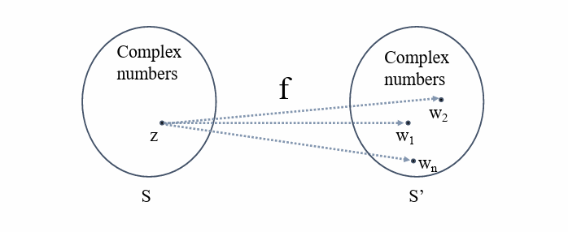
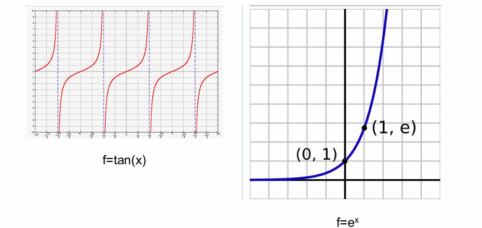
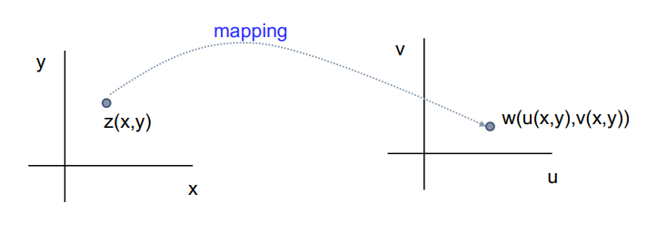
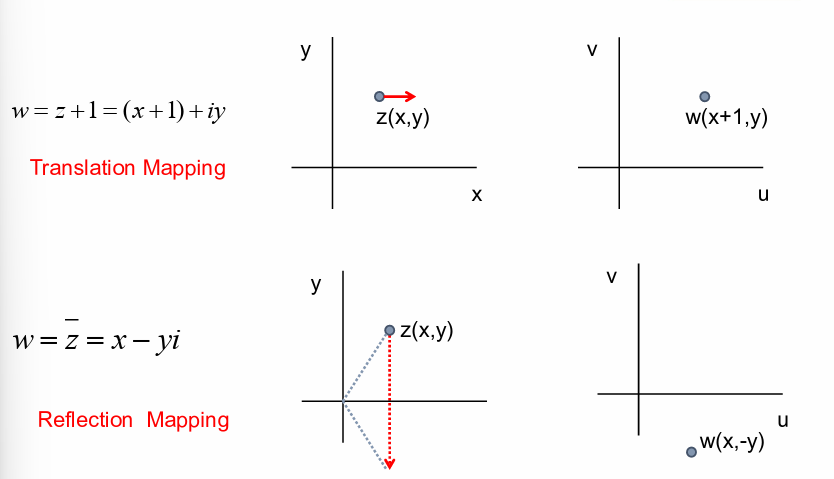
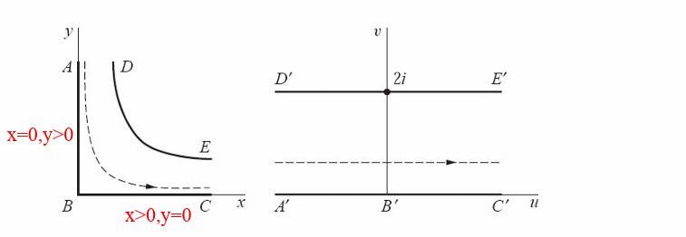
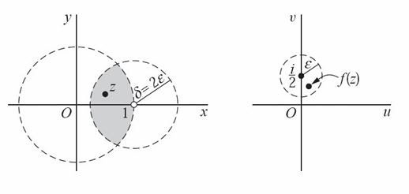
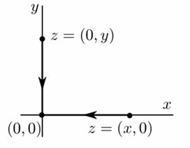

# Analisis Variabel Kompleks
## Analisis Variabel Kompleks-3
### 1. Function of a complex variable
Let S be a set complex numbers. A function f defined on S is a rule that assigns to each z in S a complex number w.

Suppose that $ w = u + iv $ is the value of a function $f$ at $z = x + iy$, so that
$$ u + iv = f(x+iy) $$
Thus each of real number u and v depends on the real variables x and y, meaning that
$$ f(z) = u(x,y) + iv(x,y) $$
Similarly if the polar coordinates r and θ, instead of x and y, are used, we get
$$ f(z) = u(r,\theta) + iv(r,\theta) $$

* **Example**
  
  If $f(z)=z^2$, then
  case #1 : $ z = x + iy $
  $$ f(z) = (x+iy)^2 = x^2 - y^2 + i2xy $$
  $$ u(x,y) = x^2 - y^2 ; v(x,y) = 2xy $$

  case #2 : $ z = re^{i\theta} $
  $$  f(z) = (re^{i\theta})^2 = r^2e^{i2\theta} = r^2 \cos 2\theta + ir^2 \sin 2\theta $$
  $$ u(r,\theta) = r^2 \cos 2\theta ; v(r,\theta) = r^2 \sin 2\theta $$

* **Example**

A real-valued function is used to illustrate some important concepts later in this chapter is
$$ f(z) = |z|^2 = x^2 + y^2 + i0 $$

* **Polynomial function**
  $$ P(z) = a_0 + a_1z + a_2z^2 + \dots + a_nz^n $$
  where n is zero or a positive integer and $ a_0, a_1, \dots a_n $ are complex constants, $a_n$ is not 0; 

!!! note "Note" 

    The domain of definition is the entire z plane

* **Rational function**

      the quotients $P(z)/Q(z)$ of polynomials

!!! note "Note"

    The domain of definition is $Q(z)\neq0$

* **Multiple-valued function**
  
      A generalization of the concept of function is a rule that assigns more than one value to a point z in the domain of definition.

* **Example**
   
Let $ z $ denote any nonzero complex number, then $z^{1/2}$ has the two values 
$$ z^{1/2} = \pm \sqrt{r} \exp(i \frac{\theta}{2}) $$
If we just choose only the positive value of $\pm \sqrt{r}$
$$ z^{1/2} = \sqrt{r} \exp(i \frac{\theta}{2}), r > 0 $$

### 2. Mappings
* **Graphs of Real-value function**

!!! note "Note"

    Note that both $x$ and $f(x)$ are real values.

* **Complex-value functions**

$$ f(z) = f(x+yi) = u(x,y) + iv(x,y) $$
{align=center}
!!! note "Note"

    Note that here $ x, y, u(x,y) $ and $ v(x,y) $ are all real values.
* **Examples**

{align=center}

* **Examples**

$$ w = iz = i(re^{i\theta}) = r \exp(i(\theta+\frac{\pi}{2})) $$

* **Example 1**

 $ w = u(x,y) + jv(x,y)$, where $ u = x^2 - y^2 $, $ v = 2xy $

* **explanation:**
    * for $ c_1 > 0, x^2 - y^2 = c_1$ is mapped onto the line $ u = c_1 $
    * if $ u = c_1 $ then $ v = \pm\sqrt{y^2+c_1} $ , where $ -\infty < y < \infty $
    * for $ c_2 > 0, 2xy = c_2 $ is mapped into the line $ v = c_2 $
    * if $ v = c_2 $ then $ u = {c_2^2}/{4y^2} - y^2 $ where $ -\infty < y < 0 $, or
    * if $ v = c_2 $ then $ u = x^2 - {c_2^2}/{4x^2}, 0 < x < \infty $

* **Example 2**

The domain $ x>0, y>0, xy<1 $ consists of all points lying on the upper branches of hyperbolas 

{==

$ u = x^2 - y^2 ;$   $v = 2xy = 2 \Rightarrow xy = 1 $ 

==}

* **Example 3**

$ w = z^2 = r^2e^{i2\theta} $  &emsp;&emsp;In polar coordinate 

the mapping $ w = r^2 e^{j2\theta} = \rho e^{j\theta} $ where
$$ \rho = r^2, \phi = 2\theta $$

* **explanation:**
    * the image is found by squaring the modulus by doubling the value $\theta$
    * we map first quadrant onto the upper half plane $\rho \ge 0, 0 \le \phi \le \pi $
    * we map the upper half plane onto the entire $ w $ plane

### 3. Mappings by the Exponential Function
* **Example 1**

$ w = e^z = e^{x+iy} = $<mark> $e^x e^{iy}$ </mark> $ , z = x + iy $
!!! note inline end "Note"

    Notice that, ==$ e^x e^{iy} $== is in a form $ \rho e^{i\theta}. $ Where, $\rho = e^x, \theta = y $

* **explanation:**
    * a vertical line $ x = c_1 $ is mapped into the circle of radius $ c_1 $
    * a horizontal line $ y = c_2 $ is mapped into the ray $ \phi = c_2 $

* **Example 2**

* **Example 3**

### 3. Limits
* For a given positive value $\epsilon$, there exists a positive value $\delta$ (depends on $\epsilon$) such that

 when $ 0 <|z-z_0| < \delta $, we have $ |f(z)-w_0|< \epsilon $ 

  meaning the point $ w=f(z) $ can be made arbitrarily close to $ w_0 $ if we choose the point $z$ close enough to $z_0$ but distinct from it.

**example:** let $ f(z) = 2j \bar z $, show that $\lim_{z\to 1} f(z) = 2j $ 

we must show that for *any* $\epsilon > 0$, we can *always* find $\delta > 0 $ such that 
$$ |z - 1| < \delta \Rightarrow |2j \bar{z} - 2j| < \epsilon $$
if we express $ |2j \bar{z} - 2j| $ in terms of $ |z-1| $ by
$$ |2j \bar{z} - 2j| = 2|\bar{z}-1| = 2|z-1| $$
hence if $\delta = \epsilon/2 $ then
$$ |f(z) - 2j| = 2|z-1| < 2\delta < \epsilon $$
$f(z)$ can be made arbitrarily close $2j$ by making $z$ close to 1 enough

==how close? determined by $\delta$ and $\epsilon$==

* **Example 1**

Show that $f(z)=i\bar{z}/2 $ in the open disk $|z|<1$, then

**Proof:**
$$ \lim_{z\to1} f(z)=\frac{i}{2} $$
$$ |f(z)-\frac{i}{2}|=|\frac{i\bar {z} }{2} - \frac{i}{2}|=\frac{|i||\bar{z}-1|}{2}=\frac{|z-1|}{2} $$
$\forall \epsilon>0, \exist \delta=2\epsilon, s.t.$

when $0<|z-1|<\delta(=2\epsilon)$

$\Rightarrow 0<\frac{|z-1|}{2}<\epsilon \Rightarrow |f(z) - \frac{i}{2}| < \epsilon $
<figure markdown="span">
  { width="500" }
</figure>

* **Example 2**

**Remarks:**

* when a limit of $f(z)$ exists at $z_0$ it is **unique**
* if the limit exists, $ z \rightarrow z_0 $ means $z$ approaches $z_0$ in any arbitrary direction

**example:** let $f(z) = z/\bar{z} $

{align-left}

* if $ z = x $ then $ f(z) = \frac{x+j0}{x-j0} = 1 $ as $z \rightarrow 0, f(z) \rightarrow 1 $ along the real axis
* if $ z = jy $ then $ f(z) = \frac{0+jy}{0-jy} = -1 $ as $z \rightarrow 0, f(z) \rightarrow -1 $ along the imaginary axis

since a limit must be unique, we conclude that $ \lim_{z\to0} f(z) $ *does not* exist

### 3.1 Theorems on Limits

**Theorem** suppose $ f(z) = u(x,y) + jv(x,y) $ and
$$ z_0 = x_0 + jy_0, w_0 = u_0 + jv_0 $$
then $\lim_{z\to z_0}f(z)=w_0$ *if and only if*
$$ \lim_{(x,y)\to(x_0,y_0)} u(x,y) = u_0 $$ 
and 
$$ \lim_{(x,y)\to(x_0,y_0)} v(x,y) = v_0 $$

**Theorem** suppose $\lim_{z\to z_0} f(z) = w_0$ and $\lim{z\to z_0} g(z) = c_0 $ then

* $ \lim_{z\to  z_0} [f(z)+g(z)] = w_0 + c_0 $
* $ \lim_{z\to  z_0} [f(z)g(z)] = w_0c_0 $
* $ \lim_{z\to  z_0} \frac{f(z)}{g(z)} = w_0/c_0  $ if $ c_0 \neq 0 $

It is easy to verify the limits
$$ \lim_{z\to z_0} c = c \qquad \lim_{z\to z_0} z = z_0 \qquad \lim_{z\to z_0} z^n = z_0^n (n = 1,2,...) $$ 
For the polynomial 
$$ P(z) = a_0 + a_1z + a_2z^2 + ... + a_nz^n $$
We have that
$$ \lim_{z\to z_0} P(z) = P(z_0) $$